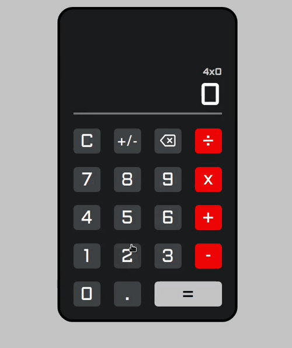

<h1 align="center">Calculator</h1>
<p align="center">
  
  </a>
</p>

<h1 align="center">
  
</h1>

**Descrição**

> Calculadora de operações básicas contruída usando ReactJs

#### Funcionalidades

- [x] O usuário pode ver uma tela mostrando o número atual digitado ou o resultado da última operação.
- [x] O usuário pode ver um teclado de entrada contendo botões para os dígitos de 0 a 9, operações - '+', '-', '/' e '=', um botão 'C' (para limpar) e um botão 'AC' (para limpar tudo).
- [x] O usuário pode inserir números como seqüências de até 7 dígitos, clicando nos dígitos no painel de entrada. A entrada de qualquer dígito acima de 8 será ignorada.
- [x] O usuário pode clicar em um botão de operação para exibir o resultado dessa operação em:
      o resultado da operação anterior e o último número digitado OU os dois últimos números digitados em OR o último número digitado.
- [x] O usuário pode clicar no botão 'C' para limpar o último número ou a última operação. Se a última entrada do usuário foi uma operação, a exibição será atualizada para o valor que a precedeu.
- [x] O usuário pode clicar no botão 'CA' para limpar todas as áreas de trabalho internas e definir a exibição como 0.
- [x] O usuário pode ver 'ERR' exibido se qualquer operação exceder o máximo de 7 dígitos.
- [x] O usuário pode clicar no botão '+/-' para alterar o sinal do número exibido no momento.
- [x] O usuário pode ver um botão de ponto decimal ('.') No teclado de entrada para permitir a inserção de números de ponto flutuante de até 3 locais e a execução de operações com o número máximo de casas decimais inseridas para qualquer número.

#### Instalar as depedências do projeto

```sh
# Com yarn
yarn install

# Com npm
npm install
```

#### Rodar o projeto

```sh
# Com yarn
yarn start

# Com npm
npm start
```

#### Autor

👤 **Daniel Ribeiro**

- Twitter: [@defauth8](https://twitter.com/defauth8)
- Github: [@defauth8](https://github.com/defauth98)
- LinkedIn: [@daniel-ribeiro-397604164](https://linkedin.com/in/daniel-ribeiro-397604164)
